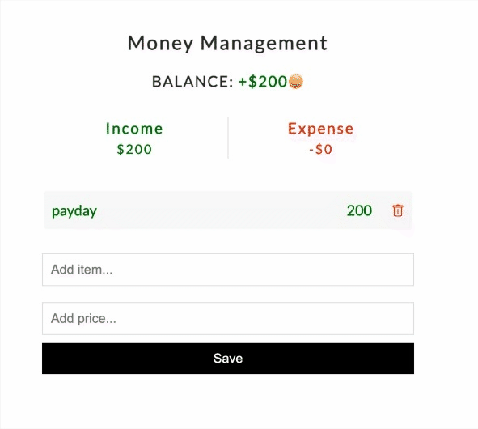

# Money Management 👛

This is a CRUD money management app built with react. Users can track their income, expense and balance.

Data is persistent by fake JSON api.

## Lessons Learned

- Fake json api
- Running local json-server
- Fetch request with method, headers, & body
- JSON.stringify

## Demo



## Run Locally

Install

```bash
  yarn
```

Start server

```bash
  yarn server
```

Start app

```bash
  yarn start
```
